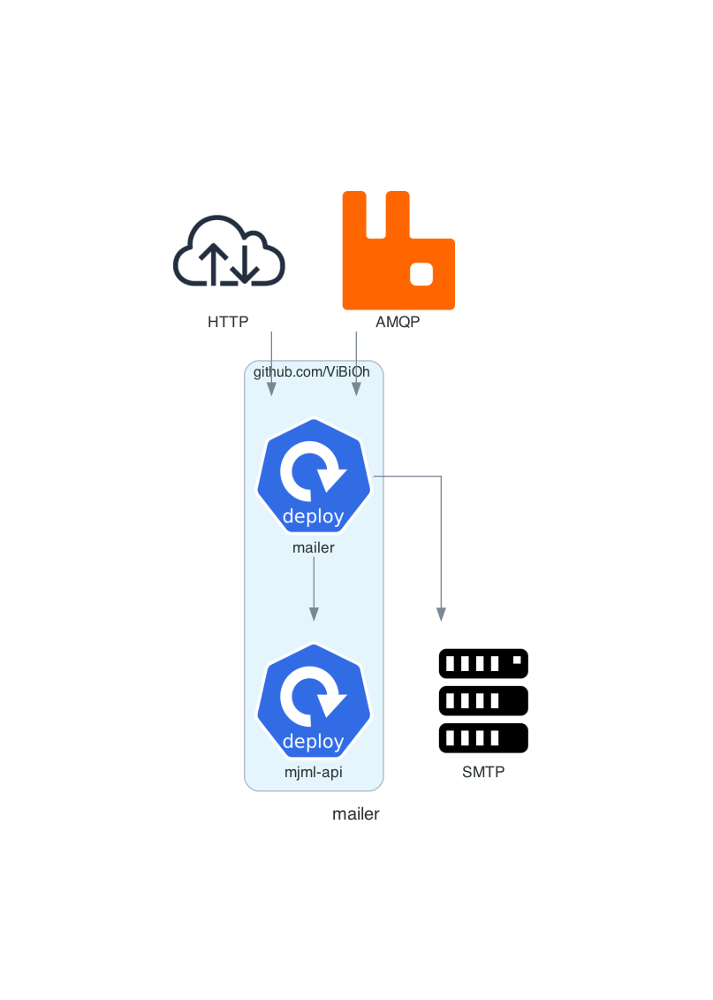

# mailer

[](https://github.com/ViBiOh/mailer/actions)
[](https://codecov.io/gh/ViBiOh/mailer)
[](https://sonarcloud.io/dashboard?id=ViBiOh_mailer)

Mailer is a service for rendering and sending email based on Golang Template with the help of MJML.



## Getting Started

Golang binary is built with static link. You can download it directly from the [Github Release page](https://github.com/ViBiOh/mailer/releases) or build it by yourself by cloning this repo and running `make`.

A Docker image is available for `amd64`, `arm` and `arm64` platforms on Docker Hub: [vibioh/mailer](https://hub.docker.com/r/vibioh/mailer/tags).

You can configure app by passing CLI args or environment variables (cf. [Usage](#usage) section). CLI override environment variables.

You'll find a Kubernetes exemple in the [`infra/`](infra/) folder, using my [`app chart`](https://github.com/ViBiOh/charts/tree/main/app)

### MJML

In order to use the MJML converter, you need to register to [MJML API](https://mjml.io/api) for having credentials or provided a compliant API like [mjml-api](https://github.com/ViBiOh/mjml-api).

## Features

- Golang templating ease-of-use and performance
- MJML conversion on-the-fly
- Read-only container
- Prometheus monitoring on a dedicated port
- Configurable logger with JSON support

## Templating & fixtures

Templates are read from the [`-templates option dir`](#usage). You can have a look at the [hello world example](templates/hello/hello.html) provided in this repository. Every files with `*.html` extension is parsed as a template.

Fixtures for each template are found from the directory where the template is. The default fixture is a file named `default.json`.

## HTTP or AMQP Client

`mailer` is capable to render and send email in a synchrone manner with the HTTP endpoint. If any action has an error (parsing, rendering, converting, sending), the HTTP response will be in error.

It can also send email in an asynchronous way with AMQP. If an error occurs, the dead-letter queue will be processed every hour and a message will be processed at most 3 times before being dropped.

## Sending email

The only provider implemented for sending emails is via the SMTP protocol. This quite-old protocol is the broader compatible: you can connect it to Postfix, to SMTP providers (e.g. MailGun, SendGrid) and is more resilient than an vendor-specific HTTP endpoint.

## Client usage

You can reach HTTP or AMQP endpoints directly or use the provided package `client` to send email easily from you Golang application. You can find a full usage example in [`cmd/client/client.go`](cmd/client/client.go)

### Endpoints

- `GET /render/`: list available templates, in JSON format
- `GET /render/{templateName}?fixture={fixtureName}`: render `templateName` as HTML with given `fixtureName` (`default` by default)
- `GET /fixtures/{templateName}/`: list available fixtures for given `templateName`, in JSON format
- `POST /render/{templateName}?from={senderEmail}&sender={senderName}&subject={emailSubject}&to={recipient}`: render `{templateName}` with data from JSON payload in body and send it with the given parameters. The `emailSubject` can be a Golang template. The `to` parameters can be passed multiple times.

- `GET /health`: healthcheck of server, always respond [`okStatus (default 204)`](#usage)
- `GET /ready`: checks external dependencies availability and then respond [`okStatus (default 204)`](#usage) or `503` during [`graceDuration`](#usage) when `SIGTERM` is received
- `GET /version`: value of `VERSION` environment variable
- `GET /metrics`: Prometheus metrics, on a dedicated port [`prometheusPort (default 9090)`](#usage)

## Usage

The application can be configured by passing CLI args described below or their equivalent as environment variable. CLI values take precedence over environments variables.

Be careful when using the CLI values, if someone list the processes on the system, they will appear in plain-text. Pass secrets by environment variables: it's less easily visible.

```bash
Usage of mailer:
  -address string
        [server] Listen address {MAILER_ADDRESS}
  -amqpExchange string
        [amqp] Exchange name {MAILER_AMQP_EXCHANGE} (default "mailer")
  -amqpMaxRetry int
        [amqp] Max send retries {MAILER_AMQP_MAX_RETRY} (default 3)
  -amqpQueue string
        [amqp] Queue name {MAILER_AMQP_QUEUE} (default "mailer")
  -amqpRetryInterval string
        [amqp] Interval duration when send fails {MAILER_AMQP_RETRY_INTERVAL} (default "1h")
  -amqpURI string
        [amqp] Address in the form amqps?://<user>:<password>@<address>:<port>/<vhost> {MAILER_AMQP_URI}
  -cert string
        [server] Certificate file {MAILER_CERT}
  -corsCredentials
        [cors] Access-Control-Allow-Credentials {MAILER_CORS_CREDENTIALS}
  -corsExpose string
        [cors] Access-Control-Expose-Headers {MAILER_CORS_EXPOSE}
  -corsHeaders string
        [cors] Access-Control-Allow-Headers {MAILER_CORS_HEADERS} (default "Content-Type")
  -corsMethods string
        [cors] Access-Control-Allow-Methods {MAILER_CORS_METHODS} (default "GET")
  -corsOrigin string
        [cors] Access-Control-Allow-Origin {MAILER_CORS_ORIGIN} (default "*")
  -csp string
        [owasp] Content-Security-Policy {MAILER_CSP} (default "default-src 'self'; base-uri 'self'; style-src 'self' 'unsafe-inline' fonts.googleapis.com; font-src fonts.gstatic.com; img-src 'self' data: http://i.imgur.com grafana.com https://ketchup.vibioh.fr/images/")
  -frameOptions string
        [owasp] X-Frame-Options {MAILER_FRAME_OPTIONS} (default "deny")
  -graceDuration string
        [http] Grace duration when SIGTERM received {MAILER_GRACE_DURATION} (default "30s")
  -hsts
        [owasp] Indicate Strict Transport Security {MAILER_HSTS} (default true)
  -idleTimeout string
        [server] Idle Timeout {MAILER_IDLE_TIMEOUT} (default "2m")
  -key string
        [server] Key file {MAILER_KEY}
  -loggerJson
        [logger] Log format as JSON {MAILER_LOGGER_JSON}
  -loggerLevel string
        [logger] Logger level {MAILER_LOGGER_LEVEL} (default "INFO")
  -loggerLevelKey string
        [logger] Key for level in JSON {MAILER_LOGGER_LEVEL_KEY} (default "level")
  -loggerMessageKey string
        [logger] Key for message in JSON {MAILER_LOGGER_MESSAGE_KEY} (default "message")
  -loggerTimeKey string
        [logger] Key for timestamp in JSON {MAILER_LOGGER_TIME_KEY} (default "time")
  -mjmlPassword string
        [mjml] Secret Key or Basic Auth password {MAILER_MJML_PASSWORD}
  -mjmlURL string
        [mjml] MJML API Converter URL {MAILER_MJML_URL} (default "https://api.mjml.io/v1/render")
  -mjmlUsername string
        [mjml] Application ID or Basic Auth username {MAILER_MJML_USERNAME}
  -okStatus int
        [http] Healthy HTTP Status code {MAILER_OK_STATUS} (default 204)
  -port uint
        [server] Listen port (0 to disable) {MAILER_PORT} (default 1080)
  -prometheusAddress string
        [prometheus] Listen address {MAILER_PROMETHEUS_ADDRESS}
  -prometheusCert string
        [prometheus] Certificate file {MAILER_PROMETHEUS_CERT}
  -prometheusGzip
        [prometheus] Enable gzip compression of metrics output {MAILER_PROMETHEUS_GZIP}
  -prometheusIdleTimeout string
        [prometheus] Idle Timeout {MAILER_PROMETHEUS_IDLE_TIMEOUT} (default "10s")
  -prometheusIgnore string
        [prometheus] Ignored path prefixes for metrics, comma separated {MAILER_PROMETHEUS_IGNORE}
  -prometheusKey string
        [prometheus] Key file {MAILER_PROMETHEUS_KEY}
  -prometheusPort uint
        [prometheus] Listen port (0 to disable) {MAILER_PROMETHEUS_PORT} (default 9090)
  -prometheusReadTimeout string
        [prometheus] Read Timeout {MAILER_PROMETHEUS_READ_TIMEOUT} (default "5s")
  -prometheusShutdownTimeout string
        [prometheus] Shutdown Timeout {MAILER_PROMETHEUS_SHUTDOWN_TIMEOUT} (default "5s")
  -prometheusWriteTimeout string
        [prometheus] Write Timeout {MAILER_PROMETHEUS_WRITE_TIMEOUT} (default "10s")
  -readTimeout string
        [server] Read Timeout {MAILER_READ_TIMEOUT} (default "5s")
  -shutdownTimeout string
        [server] Shutdown Timeout {MAILER_SHUTDOWN_TIMEOUT} (default "10s")
  -smtpAddress string
        [smtp] Address {MAILER_SMTP_ADDRESS} (default "localhost:25")
  -smtpHost string
        [smtp] Plain Auth host {MAILER_SMTP_HOST} (default "localhost")
  -smtpPassword string
        [smtp] Plain Auth Password {MAILER_SMTP_PASSWORD}
  -smtpUsername string
        [smtp] Plain Auth Username {MAILER_SMTP_USERNAME}
  -templates string
        [mailer] Templates directory {MAILER_TEMPLATES} (default "./templates/")
  -url string
        [alcotest] URL to check {MAILER_URL}
  -userAgent string
        [alcotest] User-Agent for check {MAILER_USER_AGENT} (default "Alcotest")
  -writeTimeout string
        [server] Write Timeout {MAILER_WRITE_TIMEOUT} (default "10s")
```
